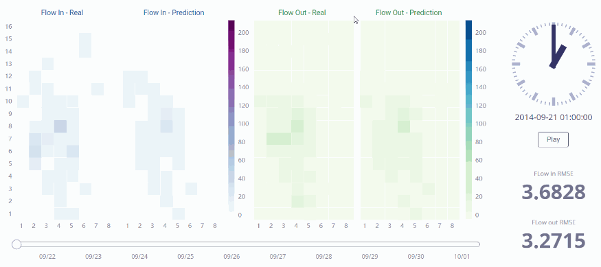

# 3DResNet for Bike-sharing Prediction


### Introduction

This is an open-source (MIT) [Pytorch](https://github.com/pytorch/pytorch) based code repository (3DResNet) for the following papers:

"Wang, B., Vu, H.L., Kim, I. and Cai, C., 2021. Short-term traffic flow prediction in bike-sharing networks. *Journal of Intelligent Transportation Systems*, pp.1-18."


It is designed to perform 3D convolution to capture more complex spatiotemporal features in traffic prediction problems. A bike-sharing dataset is used for the demonstration, and the input data, in this case, should contain 4 dimensions: (1) historical timesteps, (2) traffic flow types (in and out), (3) grid width, and (4) grid height.


### Data

The open-source bike-sharing dataset is from "Zhang, J., Zheng, Y. and Qi, D., 2017, February. Deep spatio-temporal residual networks for citywide crowd flows prediction. In *Proceedings of the AAAI Conference on Artificial Intelligence* (Vol. 31, No. 1)."

The original link is  <a href="https://github.com/lucktroy/DeepST/tree/master/data/BikeNYC">https://github.com/lucktroy/DeepST/tree/master/data/BikeNYC</a> (removed by the author now). The copy can be found at `main/data/NYC14_M16x8_T60_NewEnd.h5` in this repository. 


### Models

In this repository, we have implemented the following NN-based models:

- **3DConvNets** (this project) proposed in "Short-term traffic flow prediction in bike-sharing networks".
- **SRCNs** from "Yu, H., Wu, Z., Wang, S., Wang, Y. and Ma, X., 2017. Spatiotemporal recurrent convolutional networks for traffic prediction in transportation networks. *Sensors*, *17*(7), p.1501."
- **ST-ResNet** from "Zhang, J., Zheng, Y. and Qi, D., 2017, February. Deep spatio-temporal residual networks for citywide crowd flows prediction. In *Proceedings of the AAAI Conference on Artificial Intelligence* (Vol. 31, No. 1)."
- **ResNet34** from "He, K., Zhang, X., Ren, S. and Sun, J., 2016. Deep residual learning for image recognition. In *Proceedings of the IEEE conference on computer vision and pattern recognition* (pp. 770-778)."

Their details can be found in `main/model/net.py` and `main/model/deepst.py`. Please feel free to add your own models or other baseline models into `net.py` for comparison.


### Requirements

The PyTorch training  and evaluation framework is based on this work: <a href="https://github.com/cs230-stanford/cs230-code-examples">https://github.com/cs230-stanford/cs230-code-examples</a>. 

The following Python packages are required:

- h5py
- tqdm
- PyTorch 1.8 with CUDA


### Usage

The codes are located in `main` folder. Available options:

(1) Train a single model (available names: ResNet3D, STResnet, SRCNs, and ResNet34):

```
python train.py --model ResNet3D
```

(2) Train all models in experiments folder:

```
python train.py --model all
```

(3) Synthesize all experimental results:

```
python synthesize_results.py
```


An example on Windows 10 with PowerShell:


### Visualization

An interactive forecasting result can be found in <a href="http://resuly.me/projects/3DResNet/flow.html">http://resuly.me/projects/3DResNet/flow.html</a>




### Citation
```
@article{
    doi:10.1080/15472450.2021.1904921,
    author = {Bo Wang and Hai L. Vu and Inhi Kim and Chen Cai},
    title = {Short-term traffic flow prediction in bike-sharing networks},
    journal = {Journal of Intelligent Transportation Systems},
    volume = {0},
    number = {0},
    pages = {1-18},
    year  = {2021},
    publisher = {Taylor & Francis},
    doi = {10.1080/15472450.2021.1904921}
}
```
